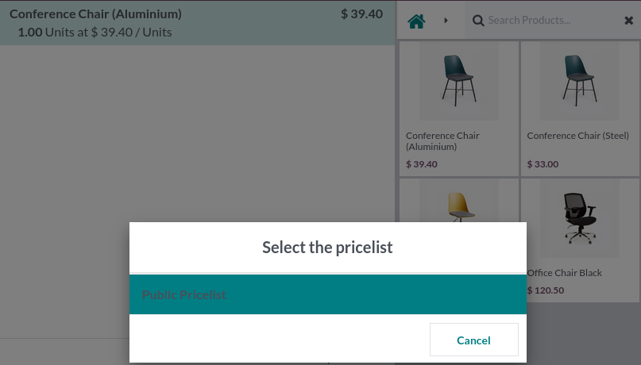

To use this module, you need to

* First configure the main module ``sale_pricelist_technical``.

* Configure your pricelist on your pos config form.

.. figure:: ../static/description/pos_config_form.png

* Open the point of sale

* Click on 'Pricelist' Button. Only non technical pricelist are displayed

