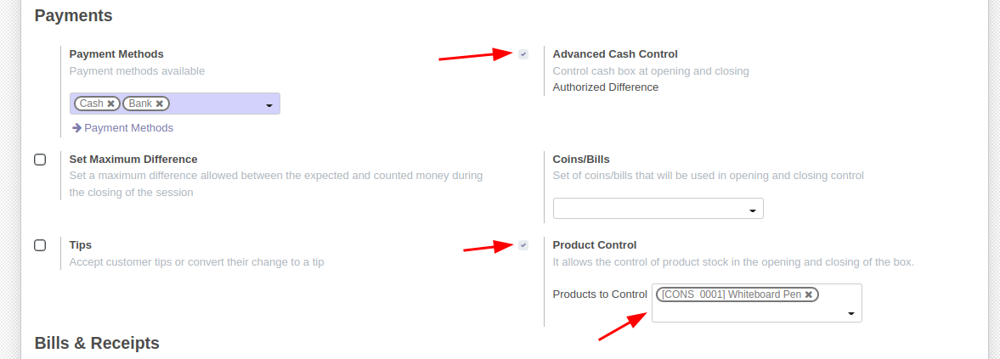
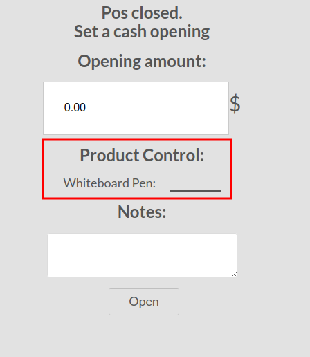
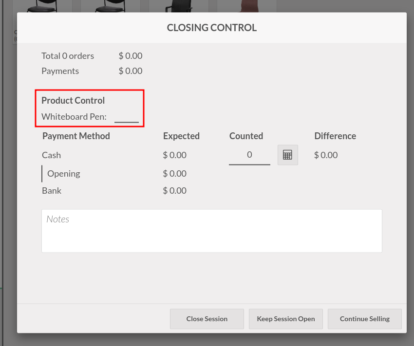
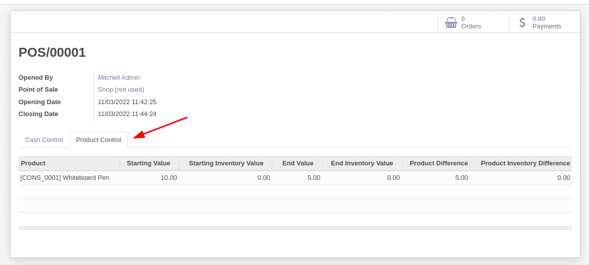

To use this module, you need to:

#. Access the configuration screen of a POS where
you want to control the products.

#. In the payments section, first enable advanced
cash control, then product control and select
which products you want to control.

#. Open a POS session.

#. During the opening process, inform the number
of items available.

#. During the closing process, inform the final
values of the items.

#. In the session records, on the "Product Control"
tab, there will be the information that was added
in the session, in addition to the values in stock.

