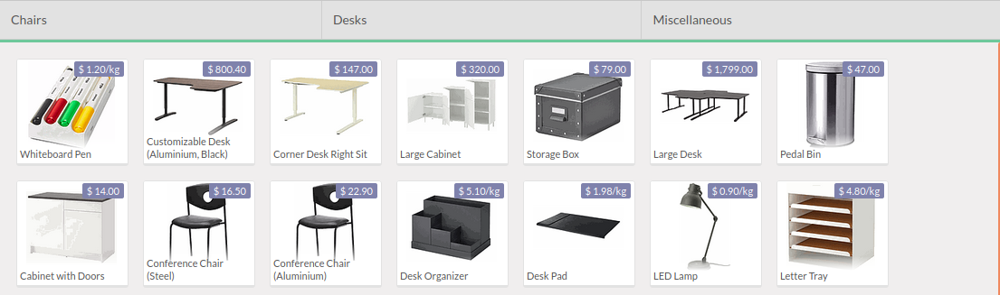
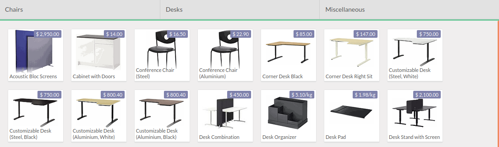

This module extends Odoo Point Of Sale features.

By default, products are sorted by sequence in the Point of Sale Front End :

This behavior is correct for a point of sale with a few products, but does not correspond to the needs of the cashiers, when there are thousands of products.

Once installed, the products are sorted by name :

