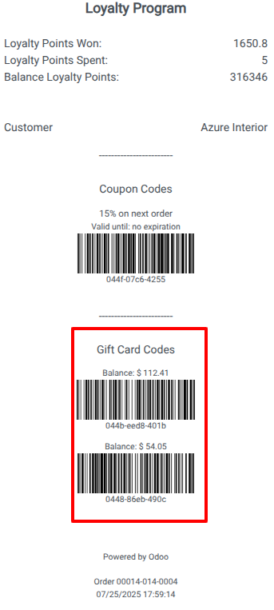

Print gift card codes and balances at the POS
-----------------------------

1. Go to *Point of Sale* > *Products* > *Gift cards & eWallet* > *Gift Card Codes*
2. Create a new Gift Card type program.
3. Enable the *Promotions, Coupons, Gift Card & Loyalty Program* option in the POS settings.
   
4. Start a new POS session, start creating orders, and when you print,
   if you have one or more gift cards associated, the codes and balance for
   each one will be displayed at the bottom.
   
