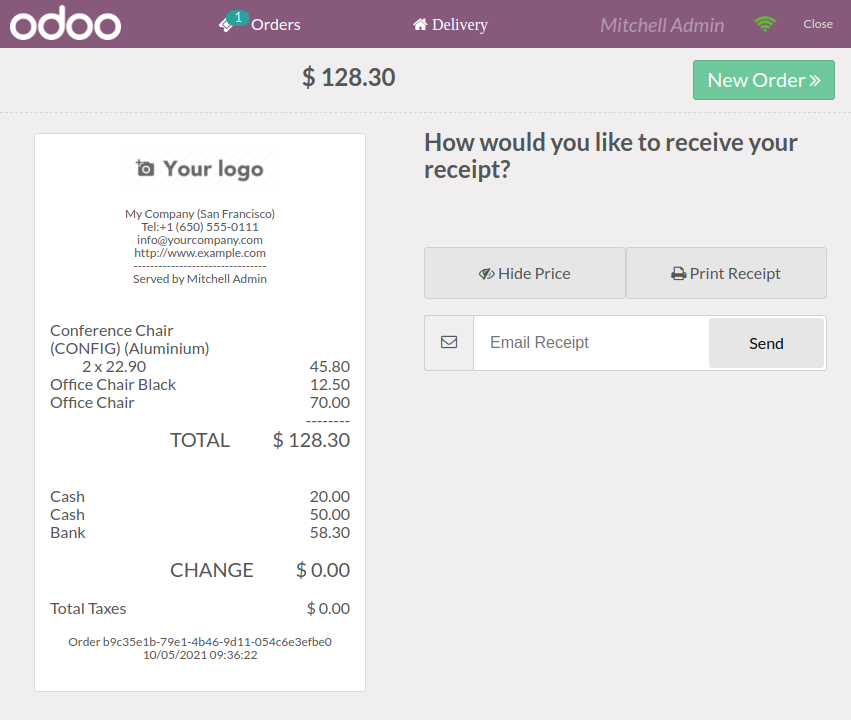
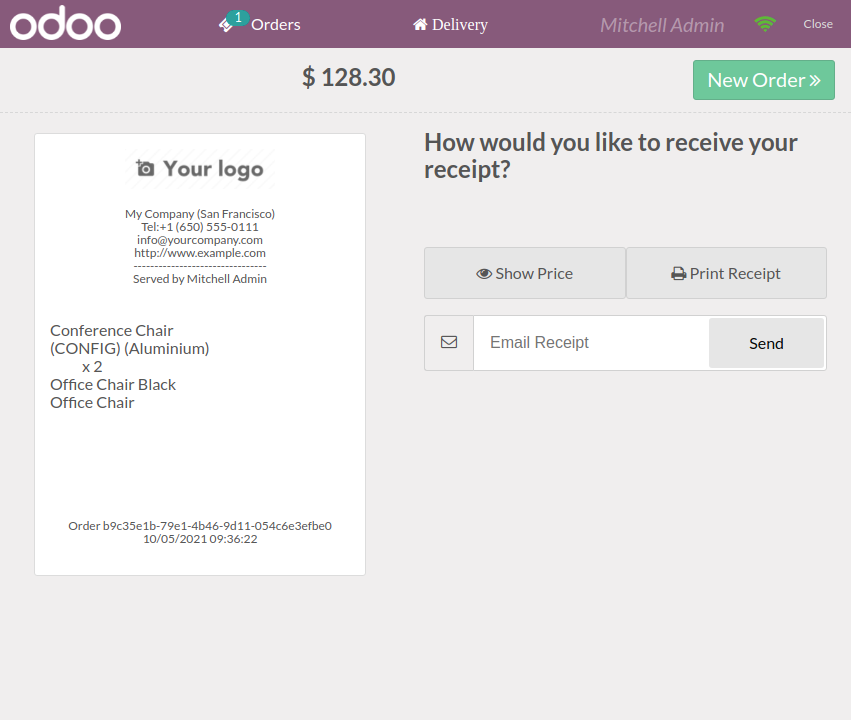

This module adds a button in the receipt view to hide price from the
receipt for printing and emailing purpose.

Clicking the hide price button transforms the receipt from:

To:

The price will also be hidden on the printed receipt and the sent email.
