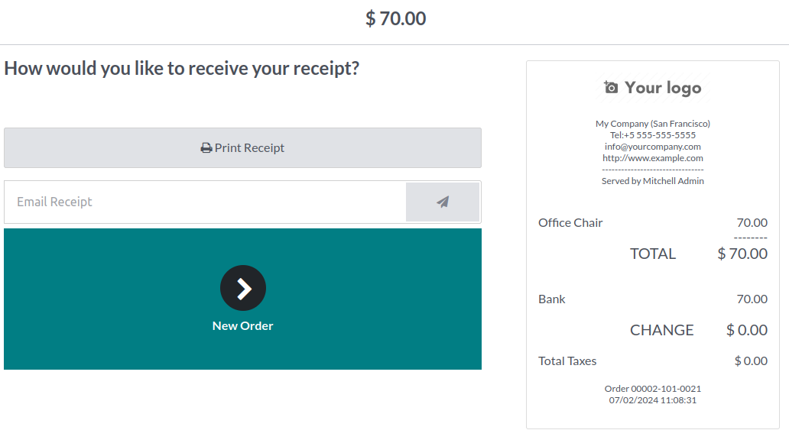
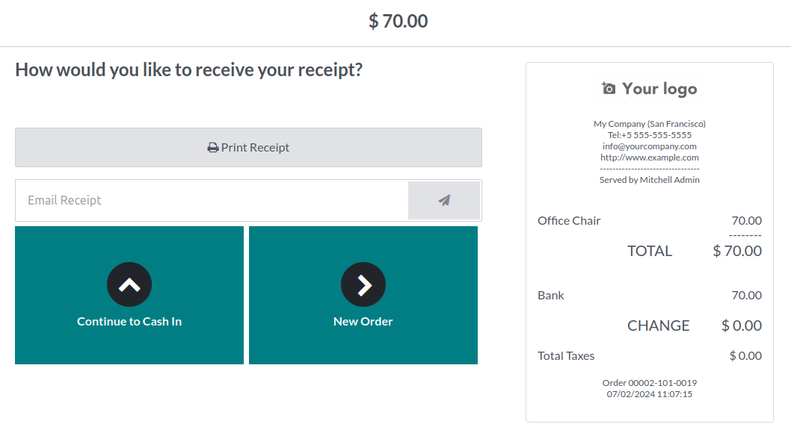

This module extends the functionality of Point of Sale Restaurant module,
improving the display of the receipt screen, in a "Split receipt" use case.

By default, at the end of a split-ticket cashing, on the receipt page,
the user only has the option of clicking on "Next order",
which creates a new blank order.

In this use case, it is preferable to return to the screen which allows
to continue "splitting" the same ticket, until all the order is paid.

**Without the module**

**With the module**

