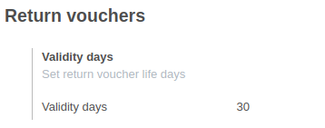

After install, to configure this module, you need to go to
*Point of Sale > Configuration > Payment methods* and create new payment method
with flag "Return voucher" enabled:

In addition, yo need to go to *Point of Sale > Configuration > Point of Sale*
and indicate the time (in days) of validity of the return vouchers issued (
you can leave this option empty and the vouchers will have an indefinite date,
i.e. they will never expire.). And add previous payment method created.

