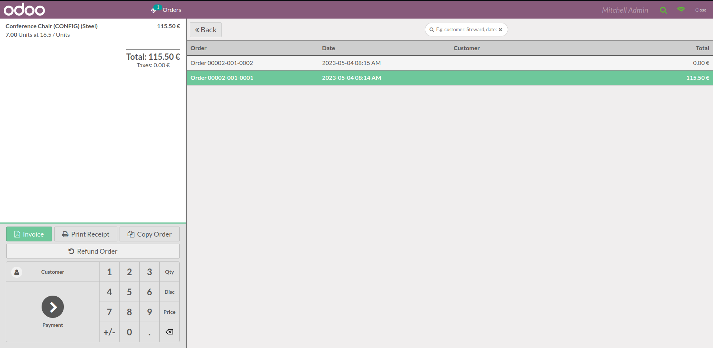
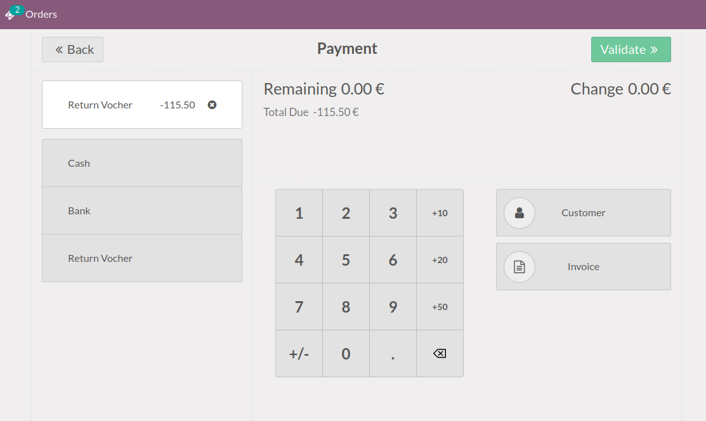
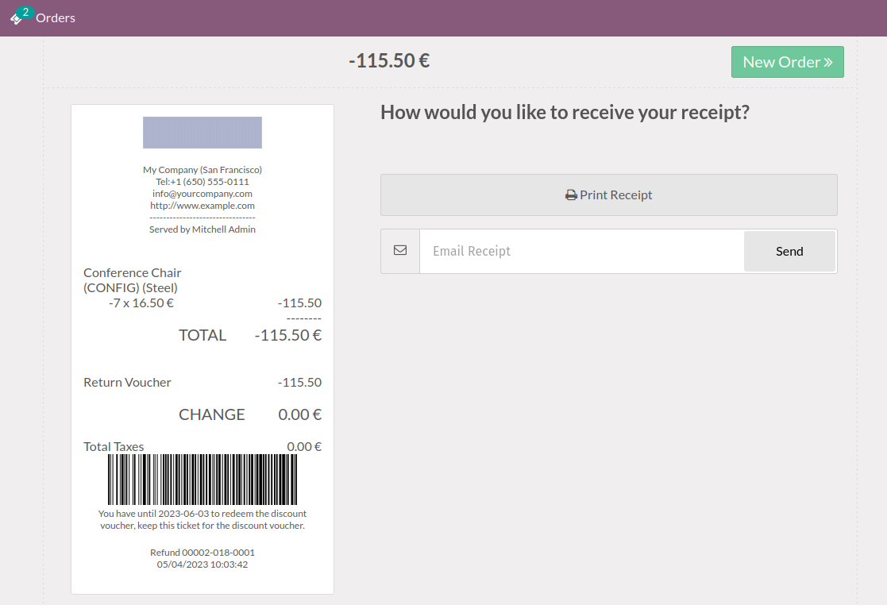
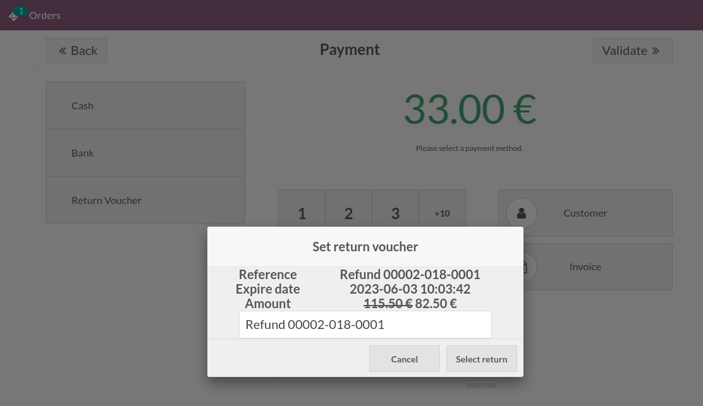

- Emitt Return Voucher

Once the PoS is loaded, you'll find a magnifying glass icon (🔎) in the top
bar that grants access to the order list screen. here you can find the number
of past orders loaded according to your configuration
(see `pos_order_mgmt` module).

Once in the return payment screen, select the payment method configured with
the "Return Voucher" flag.

When the payment is validated, the ticket will appear together with a barcode
that the customer can use for his next purchase.

- Redeem Return Voucher

Once the POS has loaded, when the customer places a new order, on the payment
screen the payment method marked with the "Return Voucher" flag can be selected,
when this is selected the user must scan the barcode. Once read, the discount
voucher info will be displayed.

When accepted, the POS will count the discount voucher as payment.

- Backend

You need to go to *Point of Sale > Orders > Return vouchers* to see return
vouchers createds or from pos order on *Payments* tab
