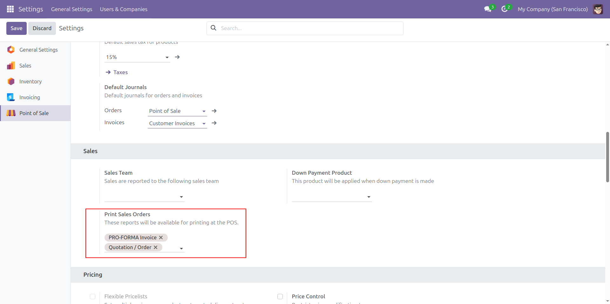
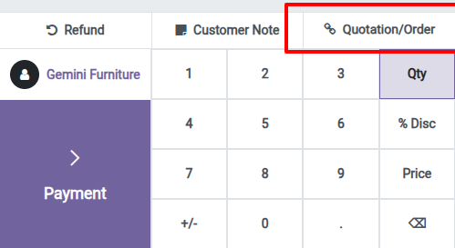
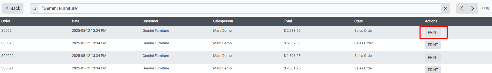
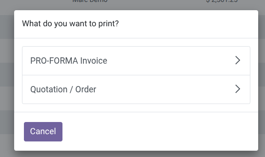

Configure the reports you want to display and print at the POS.
-----------------
> 
If no report is configured, the PRINT button will not be displayed in the order list.

How to use in the POS
--------------------
In POS click on the "Quotation/Order" button and select an order from
the list.

> 

Click the PRINT button on the order and then select which report you want to print.
> 

Select the report or cancel it.
> 
