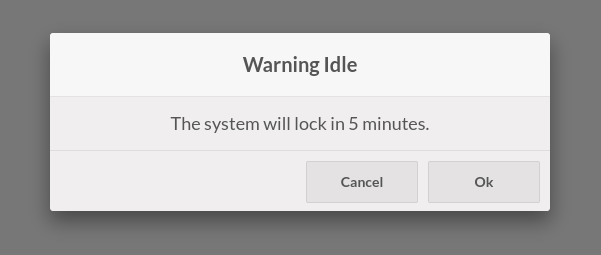

This module extends the functionality of Point of Sale (point_of_sale), and adds a PoS setting that if enabled, logs out of PoS in case of inactivity after the configured time.

You can also set a time for a warning, before the screen lock.

