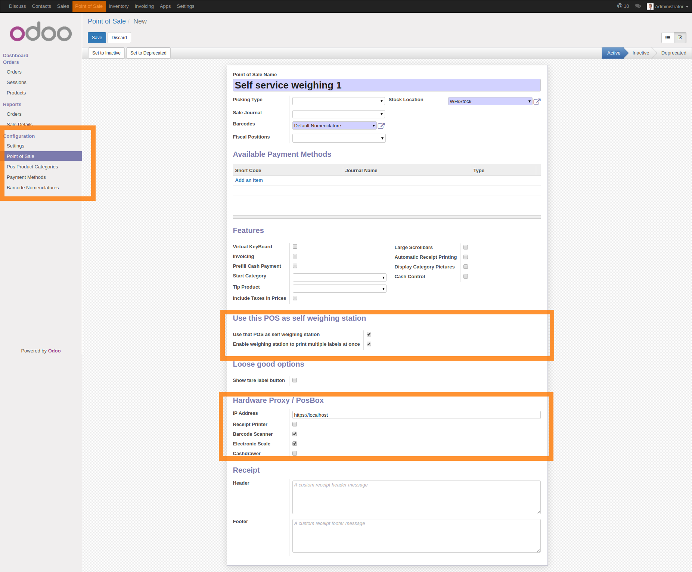

Introduction
============
Install this add-on and configure the point of sale where you want to use a self service weighing station. The label printing is done using web print.
This add-on requires to be connected to Odoo POS from a computer that'll be accessible by your customers/members. In order to limit the risk of unfortunate/malicious actions on this POS you should:

* **Use a dedicated odoo account with the least possible rights**
* Configure the web browser to be in kiosk mode (only browsing without navigation bar)

Those measures aren't sufficient *per se*, but should lower the risk significantly.

Setup the self service POS
==========================
1. Create a new POS
2. Setup hardware proxy
    * Make sure you have a valid SSL certificate issued for POSBOX host (see below).
    * Enable electronic scale
    * Enable barcode reader
3. Enable self service weighing
    * Use the checkbox as shown on screen shot below.
    * If your label printer is able to distribute several labels in a row you can select the `Enable weighing station to print multiple labels at once`. With this option your customers will be able to weigh several products and print all the labels at once. This is assumed to be more efficient.

See the screenshot below, you new POS should page should like this.

Setup a barcode for each product "to weight with a scale"
=========================================================
In the default odoo barcode nomenclature, a barcode with prefix 21 is a "weight" barcode.
The default way to process a weight barcode in odoo is to match the base part of the barcode (*ie*. the two digits prefix and the following five digits).
For instance, if you setup barcode **21 12345 00000 8** for your carrots, any barcode with pattern **21 12345 \*\*\*\*\* \*** will be a match for carrots.
This add-on uses weight barcode to encode labels. Therefore, with the previous barcode, **21 12345 01000 7** is be the label for 1kg of carrots. Be sure to have a barcode setup for each article you want to weight with a scale. See screenshot below.

SSL certificate generation
==========================
Nowadays for any internet facing service the most convenient, secure, and fast way to get SSL certificates is [letsencrypt](https://letsencrypt.org/).
However, it is likely (and expected) that your POSBox and the computer used to display to self weighing POS belong to same network.
In such a situation to use a self issued SSL certificate is a valid option.
To use a self issued SSL certificate is low maintenance as you can set an arbitrarily far expiration date.
As your HTTPS communications are expected to happen locally the security risk of using a self issued SSL certificate is fairly low.

See bash scripts in the GIST below to:
    * create a certification authority
    * self issue a SSL certificate with this certification authority
    * setup a nginx reverse proxy serving the posbox with the self issued SSL certificate
    * Install the certification authority into the web browser of the computer displaying the self weighing POS belong so that the self issued SSL certificate is considered valid by chrome and firefox.

https://gist.github.com/Fkawala/0d46376d3abb7369d34afefaa1ac98fa

Firefox
=======
See below how to setup firefox in silent printing mode is described below [source](http://manual.koha-community.org/3.2/en/firefoxreceipt.html)

1. Open File > Page Setup

   * Make all the headers and footers blank
   * Set the margins to 0 (zero)

2. In the address bar of Firefox, type about:config

   * Search for print.always_print_silent and double click it
   * Change it from false to true
   * If print.always_print_silent does not come up:
       * Right click on a blank area of the preference window
       * Select new > Boolean
       * Enter "print.always_print_silent" as the name (without quotes)
       * Click OK
       * Select true for the value

You may also want to check what is listed for print.print_printer. You may have to choose Generic/Text Only (or whatever your receipt printer might be named)

Chrome
======
Chrome base browsers have a kiosk mode. In kiosk mode the navigation bar is disabled and user action are limited to web browsing. To start a chrome base browser in kiosk mode with silent printing use the command below.

``chromium-browser --use-system-default-printer --kiosk --kiosk-printing http://localhost:8069/``
