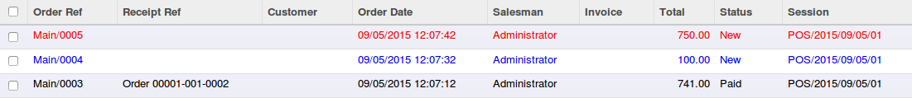
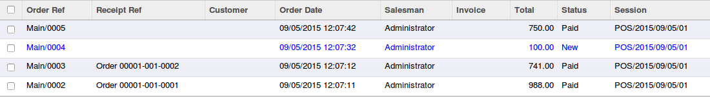
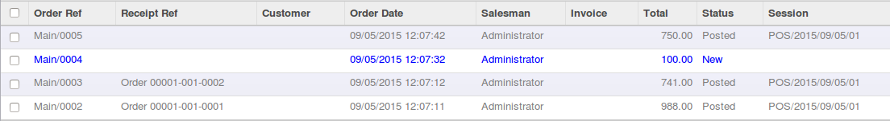
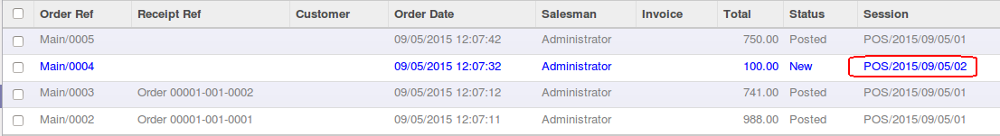

.. image:: https://img.shields.io/badge/licence-AGPL--3-blue.svg
   :target: http://www.gnu.org/licenses/agpl-3.0-standalone.html
   :alt: License: AGPL-3

==================================
Point Of Sale - Store Draft Orders
==================================

Allow to close a Session even if there are some PoS Orders in draft state.

By default, in Odoo, All PoS Orders must be in 'paid' or 'invoiced' state to
allow user to close the session.

This module can be usefull to let Orders in draft 'state' for some customers.

Feature
-------

1. New computed field 'is_partial_paid' on PoS Order

* This field is True, if the PoS order is in a draft state with some
  payments;
* Forbid to close a session if there is a partial paid Order, to avoid to have
  Account Move Lines that can not be reconciled;
* In the tree view, the partial_paid orders are displayed in red colors;

2. Possibility to close session

* if a PoS order is in a 'draft' state (without any payment), the PoS Order
  will be unassociated to the current session, when closing the session;
* When opening a new session, the PoS Orders in 'draft' state will be
  associated to the new session, based on the user_id;

**Workflow**

* The PoS order 'Main/0004' is in draft state, before closing the session

* The PoS order is unassociated of the closed session 'POS/2015/09/05/01'

* The PoS order is associated to the new opened session 'POS/2015/09/05/02'

Installation
============

This module will allow users to let orders in a draft state, only for orders
created in back-office.
If you want the same feature for the front-office PoS, please install both
modules : 'pos_store_draft_order' and 'pos_order_load'.

Configuration
=============

* A new field 'allow_store_draft_order' is available in PoS Config Model, to
  allow or block the cashier to let Orders in a draft state when closing
  session;

Usage
=====

To use this module, you need to:

* go to ...

.. image:: https://odoo-community.org/website/image/ir.attachment/5784_f2813bd/datas
   :alt: Try me on Runbot
   :target: https://runbot.odoo-community.org/runbot/xxxx/8.0

For further information, please visit:

* https://www.odoo.com/forum/help-1

Bug Tracker
===========

Bugs are tracked on `GitHub Issues <https://github.com/OCA/pos/issues>`_.
In case of trouble, please check there if your issue has already been reported.
If you spotted it first, help us smashing it by providing a detailed and welcomed feedback
`here <https://github.com/OCA/pos/issues/new?body=module:%20pos_store_draft_order%0Aversion:%208.0.1.0%0A%0A**Steps%20to%20reproduce**%0A-%20...%0A%0A**Current%20behavior**%0A%0A**Expected%20behavior**>`_.

Credits
=======

Contributors
------------

* Sylvain LE GAL (https://twitter.com/legalsylvain)
* Julien WESTE

Maintainer
----------

.. image:: https://odoo-community.org/logo.png
   :alt: Odoo Community Association
   :target: https://odoo-community.org

This module is maintained by the OCA.

OCA, or the Odoo Community Association, is a nonprofit organization whose
mission is to support the collaborative development of Odoo features and
promote its widespread use.

To contribute to this module, please visit http://odoo-community.org.
