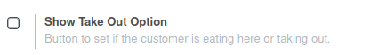

To configure this module, you need to:

* Go to 'Point Of Sale' / 'Configuration' / 'Point of Sale' and edit your
  PoS Config, enabling the button option

If not set, the default Odoo timeout will be used. (7.5 seconds in V10.0)
