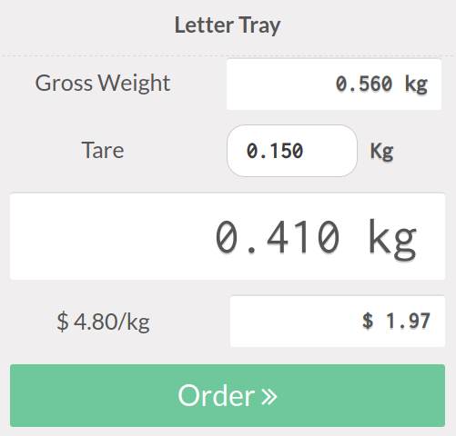

Give the possibility to the user to enter a Tare weight, when weighting
products in the Point of Sale.
This will compute automatically net weight and set it to the current
selected order

The net weight is displayed in the order with the tare value below.

