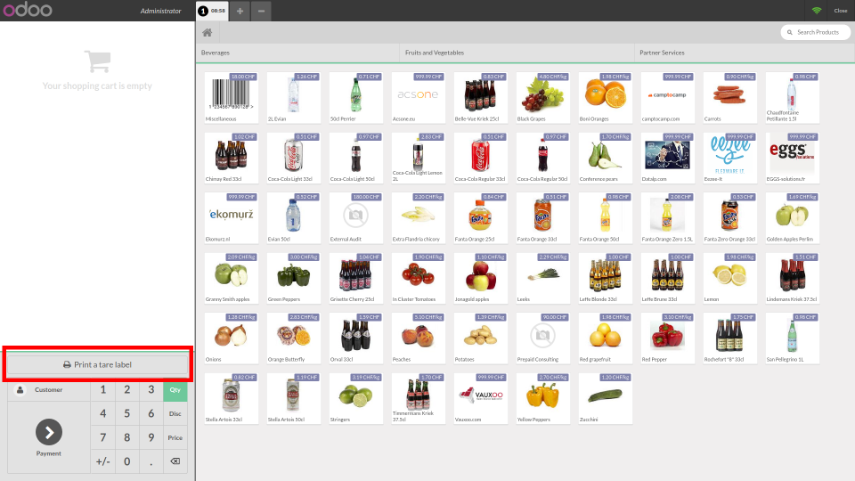
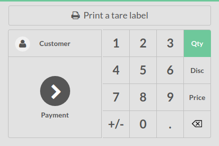

This add-on enables POS to print tare barcodes.

This add-on adds a news screen to POS to web print tare barcode labels.

The tare barcode reading is done by the `pos_tare` addon.

POS home screen becomes:

The label screen is:

.. image:: ../static/description/null_weight.png

When we read a weight the impression button is enabled

.. image:: ../static/description/ready_to_print.png

A barcode label looks like:

.. image:: ../static/description/label.png

Zoom on the updated action widget:

