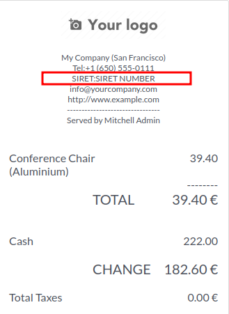

This module extends the functionality of the Point of Sale module.

It adds company SIRET and company registry fields on the PoS ticket for French companies only.

**Usage notes:**
 - This module is intended for French companies (requires l10n_fr).
 - SIRET and company registry will only be shown if set on the company and the company is configured as French (country code FR or DOM-TOM).
 - If your company is not French, these fields will not appear on the POS ticket.

