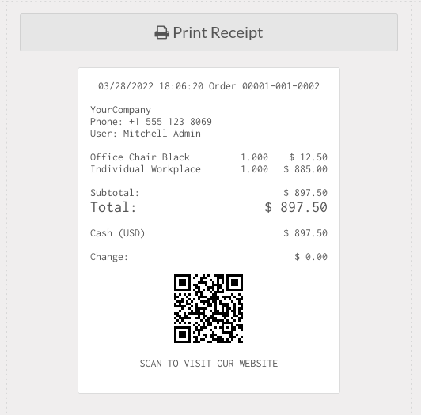

This module add a static QRCode on the POS ticket to
let your customers rate your service, visit your website,
or what ever you imagine.

While this could be achieved an unknown odoo feature
using XML Qweb in footer or header ticket defined in Pos
configuration like this (only on ticket printed via proxy
not shown in ther browser)::
    
    <!DOCTYPE QWEB>
    
    
SCAN ME TO...

So using this module makes easier to configure the static QRCode
display on PoS ticket footer.
    

