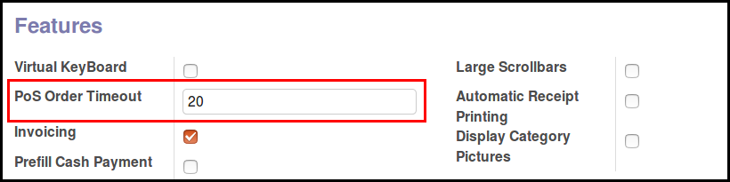

To configure this module, you need to:

* Go to 'Point Of Sale' / 'Configuration' / 'Point of Sale' and edit your
  PoS Config, setting a timeout

**Note**

- When installing the module, or for new ``pos.config`` created, the default value will
  be 30 seconds. (like in Odoo V13.0)

- If the value is not set, the default Odoo timeout will be used. (7.5 seconds in V12.0)
