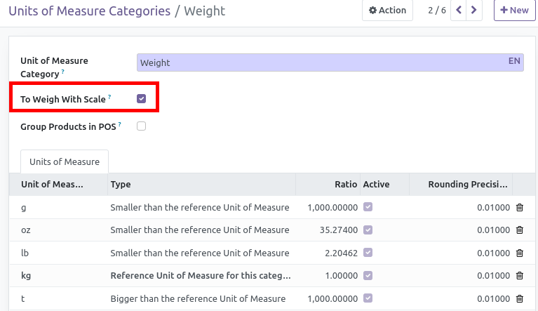

* active settings "Allow using different units of measure" in Settings > Configuration > Sales >  Quotations and Sales Orders >  Product Features

* During the creation of a category, tick the box 'To Weigh With Scale'.

Note: During the installation, the UoM Category 'Weight' is checked.
