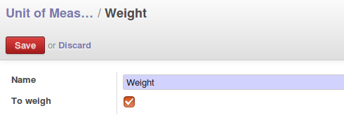
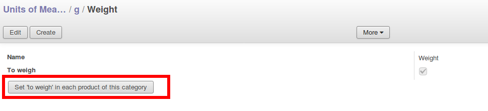

* active settings "Allow using different units of measure" in Settings > Configuration > Sales >  Quotations and Sales Orders >  Product Features

* During the creation of a category, tick the box 'To weigh'.

* You can set every product existing with the new 'To weigh' parameter

