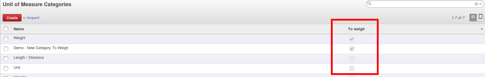
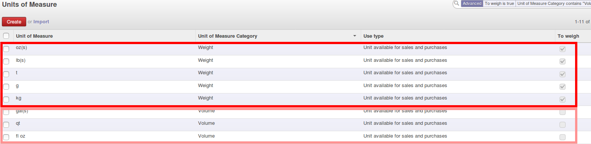
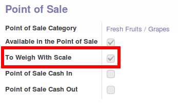
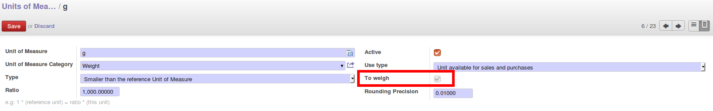

At the moment, when we create a new product and choose the unity of measure **kg**, 
we have to tick the checkbox 'To Weigh With Scale' in the Point of Sale part.

We want to speed the process of creating a new product, avoiding filling manually this parameter.

This module adds the field **'To weigh'** in UOM categories (set to **false** by default).

**→** This field affects every unities contained in this category.

**→** **AND** it is linked with the parameter **to_weight** in product.template used for example in the Point of Sale app. 

* You **CAN'T** change 'To weigh' for one UOM → You have to change in Category and affect all UOM of this category.

