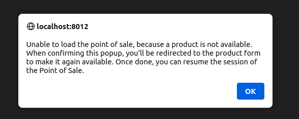

In case a product is disabled in back-office after POS session has been started
cashier will see that product in the list (as POS is asynchronous). With this module installed
an explicit alert message is display, saying that a product is not available any more
Once the alert confirm, the PoS is redirected to the product form, to let the user fix the problem.

Without this module the PoS Session silently failed.