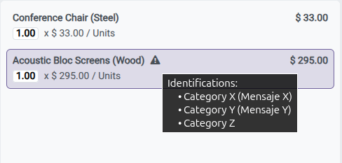
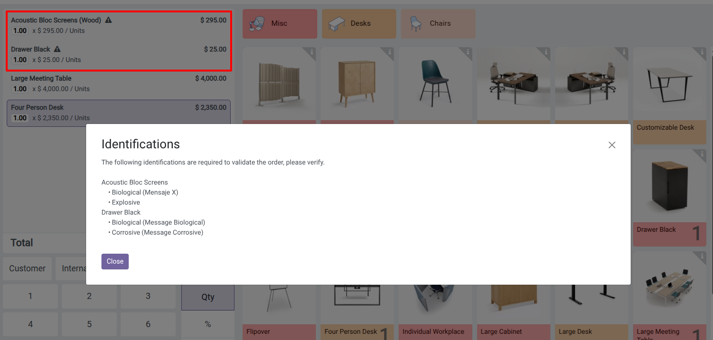
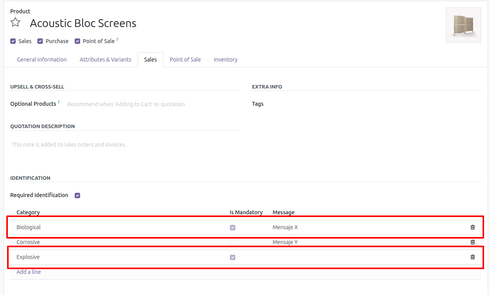
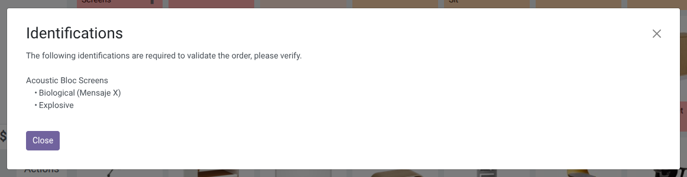
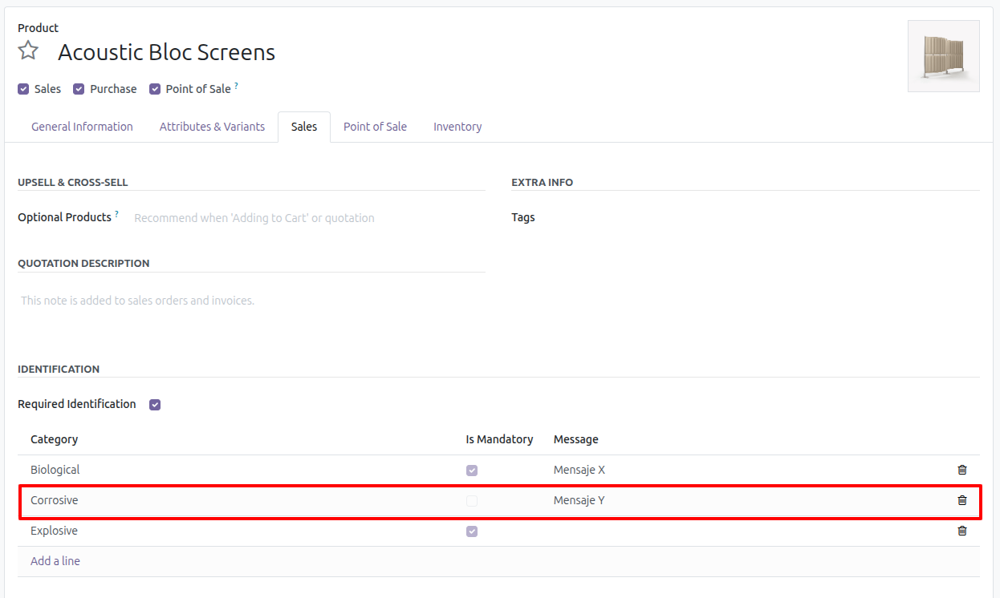
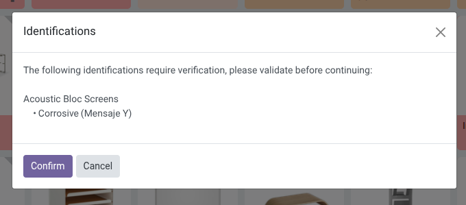

Identification required at the point of sale
---------------------------------------

1. Go to Point of Sale
2. Open a session
3. Add products that require identification; these are recognized by a hazard symbol that appears next to the name.

   

4. If you do not select a partner and there are products in the order with a required identification, the behavior
   depends on the identification enforcement flag configured in General Settings / POS configuration:

   - When enforcement is enabled, the POS blocks the sale and shows an error that forces the cashier to select a
     customer before continuing.
   - When enforcement is disabled, the POS warns the cashier so the order may proceedor may not continue after ID verification.

   

5. If you select a partner and they do not meet the required identification requirements,
   a message will be displayed with the missing information.

   
   

6. If the required IDs are validated correctly and optional IDs exist,
    a window will be displayed for the user to validate if everything is correct and if affirmative,
    the process continues normally.

### Offline behavior

- If the browser detects that it is offline, the POS blocks sales for products requiring identification whenever
   enforcement is enabled, because validations cannot be confirmed against the server.
- When enforcement is disabled and the POS temporarily loses connection during validation, a warning dialog lists the
   affected products and lets the cashier decide whether to continue without verification or cancel.

   
   
